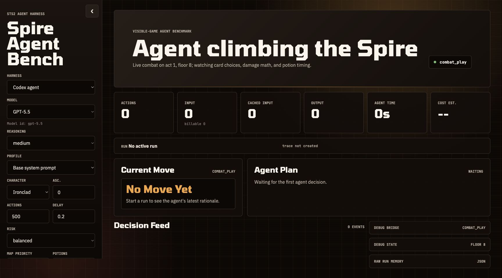

# Slay the Spire 2 Agent Harness

Tune an AI coding-agent harness and let it play the visible Slay the Spire 2 game.

This project wraps the live STS2 bridge with:

- a normalized game-state API for agents
- Codex CLI, Claude Code, and Cursor Agent harnesses
- editable agent profiles in Markdown
- run memory and JSONL traces
- a local dashboard for watching decisions, public rationales, tool calls, token usage, and cost estimates

The goal is to make agent behavior easy to inspect and easy to modify. You can change the system prompt, model, reasoning tier, route preference, potion policy, and character, then watch how far the agent climbs.



Gameplay demo: [docs/demo.mp4](docs/demo.mp4)

## Status

This is an early playable harness. It can start visible runs, choose map nodes, play combats, handle rewards, and show run traces in the dashboard. Slay the Spire 2 is still new, so expect edge cases when the game introduces unusual screens, relic-specific card selection flows, or encounters the prompt does not understand yet.

## Quickstart

This path assumes macOS, Steam, and the default Slay the Spire 2 install location.

```bash
git clone https://github.com/banjtheman/slay_the_spire_2_agent_harness.git
cd slay_the_spire_2_agent_harness

python3 -m venv .venv
source .venv/bin/activate
python -m pip install -e .

./scripts/setup_live_bridge.sh
```

Then:

1. Launch Slay the Spire 2 from Steam.
2. Open the in-game mod manager and enable `STS2_Bridge`.
3. Fully quit and reopen Slay the Spire 2 after enabling or rebuilding the bridge.
4. Check the bridge:

```bash
python -m live_bridge doctor
python -m live_bridge state
```

5. Start the dashboard:

```bash
python -m agent_dashboard --port 8787
```

6. Open `http://127.0.0.1:8787/`.
7. Pick a harness, model, character, strategy, and prompt.
8. Click `Play`.

Start small while testing:

```bash
python -m agent_harness run --harness codex-cli --start-run --max-steps 3 --execute
```

## Requirements

- macOS
- Steam copy of Slay the Spire 2
- Python 3.10+
- Git
- .NET 9 SDK or newer for building the `STS2_Bridge` plugin
- At least one supported agent CLI:
  - Codex CLI: `codex`
  - Claude Code: `claude`
  - Cursor Agent: `cursor-agent`

Install common local tools:

```bash
brew install git python
brew install --cask dotnet-sdk
```

Agent CLI setup depends on the harness you want to run:

```bash
# Codex CLI
codex --version

# Claude Code
claude --version

# Cursor Agent
cursor-agent login
cursor-agent models
```

Only one agent CLI is required. The dashboard can show all harness choices, but a run only works if the selected CLI is installed and authenticated.

## Install the Visible Game Bridge

The harness controls the actual visible game through the `STS2_Bridge` in-game mod. The helper script vendors the upstream `CLI-Anything` bridge project under `.vendor/`, applies the compatibility patch in `patches/`, builds the plugin, and installs it into the Steam game directory.

```bash
./scripts/setup_live_bridge.sh
```

If your game is not in the default Steam location, set one of these:

```bash
STS2_GAME_ROOT="/path/to/Slay the Spire 2" ./scripts/setup_live_bridge.sh
STS2_GAME_DATA_DIR="/path/to/data_sts2_macos_arm64" ./scripts/setup_live_bridge.sh
```

The default macOS game data path is:

```text
~/Library/Application Support/Steam/steamapps/common/Slay the Spire 2/SlayTheSpire2.app/Contents/Resources/data_sts2_macos_arm64
```

After setup:

```bash
python -m live_bridge doctor
```

Expected healthy shape:

```json
{
  "ok": true,
  "base_url": "http://localhost:15526",
  "decision": "menu"
}
```

If the bridge is offline, confirm the game is running, `STS2_Bridge` is enabled, and the game was restarted after bridge install.

## Start the Dashboard

```bash
python -m agent_dashboard --port 8787
```

Open:

```text
http://127.0.0.1:8787/
```

The dashboard lets you pick:

- harness: Codex CLI, Claude Code, Cursor Agent
- model and reasoning/variant
- agent profile directory
- character: Ironclad, Silent, Defect, Regent, Necrobinder
- ascension
- route strategy, risk posture, and potion policy
- the selected profile's `AGENTS.md` system prompt
- whether to start a fresh run

Run traces are written to `agent_runs/*.jsonl`. The dashboard tails those files and summarizes the current plan, latest move, public rationale, usage, cost estimate, and tool events.

## Run From the CLI

Check bridge and CLI availability:

```bash
python -m agent_harness doctor
```

Ask a harness for one move from a sample state without touching the game:

```bash
python -m agent_harness decide \
  --harness codex-cli \
  --state-file agent_harness/examples/sample_combat_state.json
```

Start a fresh visible run and let the agent execute actions:

```bash
python -m agent_harness run \
  --harness codex-cli \
  --model gpt-5.5 \
  --reasoning-effort medium \
  --start-run \
  --character IRONCLAD \
  --ascension 0 \
  --max-steps 50 \
  --execute
```

Claude Code:

```bash
python -m agent_harness run \
  --harness claude-code \
  --model sonnet \
  --reasoning-effort medium \
  --start-run \
  --max-steps 50 \
  --execute
```

Cursor Agent:

```bash
python -m agent_harness run \
  --harness cursor-cli \
  --model composer-2.5-fast \
  --start-run \
  --max-steps 50 \
  --execute
```

For Cursor, the thinking/speed tier is encoded into the model id. Use:

```bash
cursor-agent models
```

## Tune an Agent

The default profile is:

```text
agent_profiles/codex_base/
```

Important files:

- `AGENTS.md`: core play policy and response constraints
- `ENCOUNTERS.md`: encounter-specific tactics injected when matching enemies/statuses appear
- `ENCOUNTER_RESEARCH_NOTES.md`: scratch notes for improving encounter guidance

The dashboard can edit and save the selected profile's `AGENTS.md`. Changes apply to the next run; active runs keep the prompt they started with.

To create a new profile:

```bash
cp -R agent_profiles/codex_base agent_profiles/my_profile
```

Refresh the dashboard and select the new profile, or run it from the CLI:

```bash
python -m agent_harness run \
  --agent-workdir agent_profiles/my_profile \
  --start-run \
  --max-steps 50 \
  --execute
```

## Debugging

Use this order when something fails.

1. Check the game and bridge:

```bash
python -m live_bridge doctor
python -m live_bridge state
```

2. Check the agent CLIs:

```bash
python -m agent_harness doctor
```

3. Ask for one dry-run decision:

```bash
python -m agent_harness run --harness codex-cli --max-steps 1
```

4. Execute one live action:

```bash
python -m agent_harness run --harness codex-cli --max-steps 1 --execute
```

5. Inspect the latest trace:

```bash
ls -lt agent_runs/*.jsonl | head
tail -n 40 agent_runs/<trace-file>.jsonl
```

Common failures:

- `bridge offline`: launch STS2, enable `STS2_Bridge`, then fully restart the game.
- `decision: menu`: the game is at the main menu. Use `--start-run` or check `Start or restart run` in the dashboard.
- `.NET SDK does not support targeting .NET 9.0`: install a .NET 9+ SDK and rerun `./scripts/setup_live_bridge.sh`.
- `Could not apply bridge compatibility patch`: upstream `CLI-Anything` changed. See the patching section below.
- `Method not found` from the bridge: rebuild/reinstall the bridge, then fully restart STS2.
- Agent times out: lower `max_steps`, increase `--agent-timeout`, or test `decide` with the sample state first.
- Agent chooses invalid or stale actions: check the JSONL trace. The runner re-reads state after each action, but new game screens may need bridge normalization or prompt guidance.

Local outputs are ignored by git:

```text
agent_runs/
.vendor/
```

## Updating or Patching the Bridge

The bridge source is vendored at setup time:

```bash
.vendor/CLI-Anything/slay_the_spire_ii/agent-harness/bridge/
```

This repo carries one patch:

```text
patches/cli-anything-sts2-bridge-compat.patch
```

The setup script applies that patch before building. If the patch fails because upstream changed:

```bash
rm -rf .vendor/CLI-Anything
./scripts/setup_live_bridge.sh
```

If it still fails, update the patch:

```bash
git clone https://github.com/HKUDS/CLI-Anything.git /tmp/CLI-Anything
cd /tmp/CLI-Anything
git apply /path/to/slay_the_spire_2_agent_harness/patches/cli-anything-sts2-bridge-compat.patch
# fix conflicts or API changes
git diff > /path/to/slay_the_spire_2_agent_harness/patches/cli-anything-sts2-bridge-compat.patch
```

Then rerun:

```bash
./scripts/setup_live_bridge.sh
```

Always fully quit and restart Slay the Spire 2 after reinstalling the bridge. The running game process keeps the old DLL loaded.

## Adding More Agents

There are two levels of customization.

For a new play style, add a profile:

```bash
cp -R agent_profiles/codex_base agent_profiles/aggressive_elite_hunter
```

Edit `AGENTS.md` and `ENCOUNTERS.md`. Any profile directory with an `AGENTS.md` appears in the dashboard profile selector after refresh.

For a new agent CLI or harness:

1. Add a wrapper class in `agent_harness/codex_cli.py` or split wrappers into a new module.
2. The wrapper should return an `AgentDecision` matching `agent_harness/action.schema.json`.
3. Add the harness choice in `agent_harness/__main__.py`.
4. Add server-side construction in `agent_dashboard/server.py`.
5. Add dashboard model/reasoning options in `agent_dashboard/static/app.js`.
6. Test without the game:

```bash
python -m agent_harness decide \
  --harness your-harness \
  --state-file agent_harness/examples/sample_combat_state.json
```

7. Test one visible action:

```bash
python -m agent_harness run --harness your-harness --max-steps 1 --execute
```

## Architecture

```text
Slay the Spire 2 visible game
  -> STS2_Bridge on localhost:15526
  -> live_bridge normalizes state/actions
  -> agent_harness builds prompts and calls an agent CLI
  -> JSON action is executed through the bridge
  -> traces and run memory are written under agent_runs/
  -> agent_dashboard displays the run
```

The harness intentionally asks agents for a single structured action at a time. This keeps failures recoverable: after each action, the harness re-reads the live game state before asking for the next move.

## Safety and Cost

Agent runs can spend real model tokens quickly. Start with low `max_steps`, conservative models, or dry-run mode before letting an agent play a long run.

Dry-run one move:

```bash
python -m agent_harness run --harness codex-cli --max-steps 1
```

Execute one move:

```bash
python -m agent_harness run --harness codex-cli --max-steps 1 --execute
```

The default Codex harness runs in read-only sandbox mode with no approval prompts. Enabling agent tools or web search gives the model a larger action surface.

## Repository Layout

```text
agent_dashboard/       local web dashboard
agent_harness/         agent CLI wrappers, runner, memory, prompts
agent_profiles/        editable Markdown harness profiles
live_bridge/           STS2_Bridge HTTP client and normalized CLI
patches/               compatibility patch applied to the vendored bridge
scripts/               setup helper for the in-game bridge
```

## License

See `LICENSE`.
